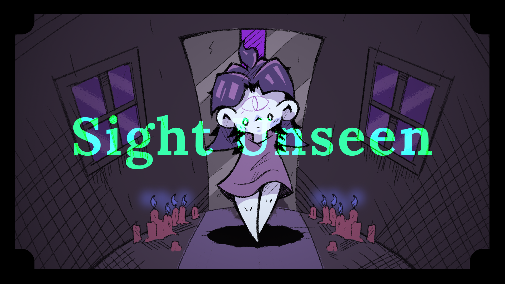

# 🎮 Sight Unseen

**🏆 Finalist at Brackeys Game Jam 2026.1!**

*Sight Unseen* is a 2D Puzzle-Platformer game created in just one week for the Brackeys Game Jam 2026.1 on itch.io, where it proudly reached the finals!

👉 **[Play the game on itch.io](https://snir3308.itch.io/sight-unseen)**

## 📖 Background & Story
Who doesn't like to explore strange abandoned buildings? it's mysterious, exciting and thrilling. But how does it feel when you're blind?
Sight Unseen is a game about a blind girl exploring an abandoned building, she can't see the real world, but she has psychic prowess allowing her to see the edgy and sketchy world that the normal human-being's not able to see.

## ⌨️ Controls
* **Mouse Movement**  To control your third eye
* **A, D** To move sideways
* **Spacebar:** To jump
* **W, S, E** for different interactions

## 🛠️ Built With
* **Game Engine:** Unity
* **Language:** C#

## 🤝 Credits
* Art by **Shon Krich** and **Snir Lerner**
* Prorgrammed by **May Shvarts** and **Meital Lubarski**
